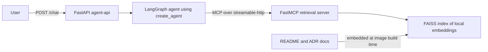

# ragmesh

[](https://github.com/BaliDataMan/ragmesh/actions/workflows/ci.yml)


Retrieval as a mesh of MCP services — an agentic RAG platform built on
LangGraph. A single ReAct-style agent talks to a real MCP retrieval server
over the network (not an in-process function call), backed by a local FAISS
vector store. Provider-agnostic (Anthropic / OpenAI / Bedrock).

The sample corpus is this repo's own documentation (`README.md` + `project-docs/adr/`)
— ask it how its own retrieval pipeline works.

## Architecture



`agent-api` and `mcp-server` are separate containers on a Docker network — the
retrieval tool is a real network service, not a decorated Python function.
See `project-docs/architecture-rationale.md` for the full reasoning behind every
structural choice, and `project-docs/adr/` for the three closest judgment calls
(MCP transport, MCP server library, embeddings/vector store).

## Quickstart

```bash
cp .env.example .env   # fill in ANTHROPIC_API_KEY (or OPENAI_API_KEY)
docker compose up --build
curl -X POST localhost:8080/chat \
  -H "Content-Type: application/json" \
  -d '{"question": "What MCP transport does ragmesh use, and why?"}'
```

That's the only secret required — retrieval (embeddings + FAISS) needs no
API key at all (see `project-docs/adr/0003`).

## Local development

```bash
uv sync --all-extras
uv run pytest tests/unit -v      # hermetic: no network, no model downloads
uv run ruff check .
uv run mypy src
```

Building the FAISS index locally (outside Docker):

```bash
uv run python -m ragmesh.ingest
uv run ragmesh "What transport does ragmesh's MCP server use?"
```

## Project layout

```
src/ragmesh/
  config.py, llm.py       # env-driven settings, provider-agnostic chat model
  ingest.py, retrieval.py # build + query the FAISS index
  mcp_server/server.py    # FastMCP retrieval server (streamable-http)
  agent.py                # MCP client + LangGraph agent, build-once/cache
  api.py, cli.py          # FastAPI POST /chat, thin CLI
project-docs/
  adr/                    # architecture decision records
  architecture-rationale.md, developer-guide.md
tests/unit/                # hermetic, fake models/embeddings
tests/integration/         # opt-in: real docker compose + live LLM key
```
