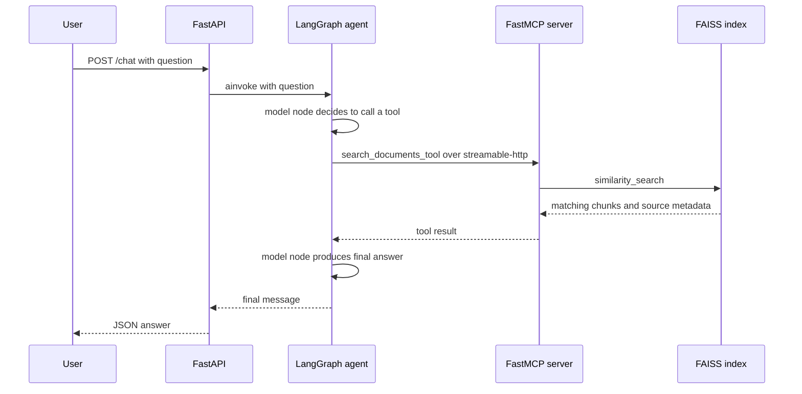

# Developer guide

End-to-end instructions for getting `ragmesh` running, testing it, and understanding
how the pieces fit together. For *why* things are built this way, see
`architecture-rationale.md` and `project-docs/adr/`. For a line-by-line understanding of
individual concepts (pydantic-settings, MCP transports, LangGraph, etc.), see
`docs/learning-notes/` (gitignored, local-only).

## Index

- [Prerequisites](#prerequisites)
- [1. Local setup (no Docker)](#1-local-setup-no-docker)
- [2. Run the test suite and linters](#2-run-the-test-suite-and-linters)
- [3. Build the FAISS index locally](#3-build-the-faiss-index-locally)
- [4. Run the full stack with Docker Compose](#4-run-the-full-stack-with-docker-compose)
  - [Editing the sample corpus](#editing-the-sample-corpus)
- [5. Run the CLI directly (no API server)](#5-run-the-cli-directly-no-api-server)
- [6. The opt-in integration test](#6-the-opt-in-integration-test)
- [7. Releasing a new version](#7-releasing-a-new-version)
- [Project layout](#project-layout)
- [How a request flows end to end](#how-a-request-flows-end-to-end)
- [Troubleshooting](#troubleshooting)

## Prerequisites

- Python 3.12 and [`uv`](https://docs.astral.sh/uv/)
- Docker + Docker Compose (for the full end-to-end path)
- An Anthropic or OpenAI API key (only needed for a real `/chat` answer — everything
  else runs without one)

## 1. Local setup (no Docker)

```bash
git clone <repo> && cd ragmesh
uv sync --all-extras
```

This creates `.venv/` and installs everything, including all provider extras
(`anthropic`, `openai`, `bedrock`) and dev tools (`pytest`, `ruff`, `mypy`).

## 2. Run the test suite and linters

```bash
uv run pytest tests/unit -v   # hermetic: no network, no model downloads, no API key
uv run ruff check .
uv run mypy src
```

All three should be clean on a fresh checkout. The unit suite uses fakes for
everything that would otherwise need a real model or network call — see
`tests/unit/` and the `cp9-*` learning notes for how.

## 3. Build the FAISS index locally

```bash
uv run python -m ragmesh.ingest
```

This embeds `README.md` + `project-docs/adr/*.md` (the sample corpus) and writes the index
to `data/faiss_index/` (gitignored). The first run downloads the embedding model
(`sentence-transformers/all-MiniLM-L6-v2`, ~80MB) from the Hugging Face Hub — no
API key required, it's a local model.

You can sanity-check retrieval directly, without starting anything else:

```bash
uv run python -c "
from ragmesh.retrieval import search_documents
for r in search_documents('What MCP transport does ragmesh use?', k=2):
    print(r['source'], '->', r['content'][:80])
"
```

## 4. Run the full stack with Docker Compose

```bash
cp .env.example .env
# edit .env: fill in ANTHROPIC_API_KEY (or OPENAI_API_KEY + RAGMESH_LLM_PROVIDER=openai)
docker compose up --build
```

What happens:
1. `mcp-server` image builds — installs deps, then **builds the FAISS index at
   image build time** (`RUN uv run --no-dev python -m ragmesh.ingest`), then starts
   the FastMCP server on `streamable-http` (internal only, not published to host).
2. `agent-api` image builds — installs deps (including the `anthropic`/`openai`
   extras), then starts FastAPI/uvicorn on host port `8080`.
3. `agent-api` waits for `mcp-server`'s healthcheck before starting
   (`depends_on: condition: service_healthy` in `docker-compose.yml`).
4. On `agent-api` startup, its FastAPI `lifespan` hook builds the LangGraph agent
   once — connects to `mcp-server` over MCP, pulls its tools, constructs the chat
   model — and keeps it cached for every request (see `cp6-fastapi-lifespan`).

Verify it's up:

```bash
curl http://localhost:8080/health
# {"status":"ok"}

curl -X POST localhost:8080/chat \
  -H "Content-Type: application/json" \
  -d '{"question": "What MCP transport does ragmesh use, and why?"}'
```

A correctly configured stack returns a grounded answer citing the ADRs/README. If
you get `HTTP 500` with an authentication error in `docker compose logs agent-api`,
that's a missing/invalid API key, not a wiring problem — the MCP connection and
agent graph construction happen at startup and will already have succeeded by
that point.

Tear down:

```bash
docker compose down
```

### Editing the sample corpus

The FAISS index is baked into the `mcp-server` image at **build** time, not
container start time (see ADR-0003 and the `cp8-docker-build-time-vs-runtime`
note for why). If you edit `README.md` or `project-docs/adr/*.md` and want the agent to
see the change, you need:

```bash
docker compose up --build   # not just `docker compose up`
```

A plain restart will not pick up doc edits.

## 5. Run the CLI directly (no API server)

```bash
uv run ragmesh "What transport does ragmesh's MCP server use?"
```

This builds the agent in-process and prints the answer — useful for quick checks
without starting FastAPI, but still needs `MCP_SERVER_URL` to point at a running
MCP server (either `docker compose up mcp-server` in the background, or run
`uv run python -m ragmesh.mcp_server.server` locally) and a real LLM key.

## 6. The opt-in integration test

```bash
uv run pytest tests/integration -m slow
```

This actually runs `docker compose up --build`, polls `/health`, hits `/chat`,
then tears the stack down. It needs Docker and a real LLM key in `.env` — it is
**not** run in CI (see `project-docs/architecture-rationale.md` #11) and should be run
manually before tagging a release.

## 7. Releasing a new version

Releases publish to [PyPI](https://pypi.org/project/ragmesh/) via a tag-triggered
GitHub Actions workflow (`.github/workflows/publish.yml`), authenticated with PyPI
Trusted Publishing (OIDC) — no API token secret involved. See
`architecture-rationale.md` #13 for why it's shaped this way.

**One-time setup (already done for this repo, documented here for reference or a
fork):**
1. On [pypi.org's Trusted Publishing settings](https://pypi.org/manage/project/ragmesh/settings/publishing/)
   for this project, add a trusted publisher: owner `BaliDataMan`, repository
   `ragmesh`, workflow filename `publish.yml`, environment name `pypi`.
2. On GitHub, under repo **Settings → Environments**, create an environment named
   `pypi` (matches the workflow's `environment: pypi`). Adding a required reviewer
   here makes every publish need a manual approval click before it runs — a good
   safety net, since a bad publish to PyPI can never be undone or overwritten.

**Every release, in order:**

```bash
# 1. Bump the version — pick the next real semver, e.g.:
#    sed -i '' 's/^version = ".*"/version = "0.2.0"/' pyproject.toml
#    (or edit pyproject.toml's `version` field directly)

# 2. Commit the bump (through the normal branch -> PR -> merge flow, same as any
#    other change — do not push a version bump straight to main)
git checkout -b chore/release-0.2.0
git add pyproject.toml
git commit -m "Bump version to 0.2.0 for release"
git push -u origin chore/release-0.2.0
# open a PR, merge it, then sync local main:
git checkout main
git fetch origin
git merge --ff-only origin/main

# 3. Tag the merged commit and push the tag — this is what actually triggers
#    the publish workflow
git tag v0.2.0
git push origin v0.2.0

# 4. If the `pypi` environment has a required reviewer, approve the run under the
#    repo's Actions tab (Review deployments -> pypi -> Approve).

# 5. Verify: check https://pypi.org/project/ragmesh/#history for the new version.
```

**Non-negotiable rule:** the git tag (`vX.Y.Z`) must exactly match `pyproject.toml`'s
`version` field (without the `v` prefix) — the workflow checks this and fails the
run otherwise, on purpose, so a mismatched release can't silently ship.

**Also update before/alongside each release:**
- This developer guide and `architecture-rationale.md` if the release changes
  anything they describe.
- `README.md`'s badges/version references if applicable.
- Any deferred-scope note (see `architecture-rationale.md` #14) whose "revisit when"
  condition the release just satisfied.

## Project layout

```
src/ragmesh/
  config.py        # pydantic-settings: env-driven config, one singleton
  llm.py           # init_chat_model() — single call site for provider swap
  ingest.py        # chunk + embed the sample corpus, build/save the FAISS index
  retrieval.py     # load the FAISS index, run similarity search
  mcp_server/
    server.py      # FastMCP server exposing search_documents_tool, streamable-http
  agent.py         # MultiServerMCPClient + create_agent, build-once/cache
  api.py           # FastAPI app: lifespan-managed agent, POST /chat, GET /health
  cli.py           # thin async CLI entrypoint (`ragmesh "question"`)
docs/
  adr/             # 3 formal architecture decision records
  architecture-rationale.md   # the fuller "why" behind every structural choice
  developer-guide.md          # this file
docker/
  mcp-server.Dockerfile, agent.Dockerfile
docker-compose.yml
tests/
  unit/            # hermetic: fake models/embeddings, in-memory MCP session
  integration/     # opt-in: real docker compose + live LLM key
.github/workflows/ci.yml   # ruff + mypy + unit tests on every push/PR
```

## How a request flows end to end



1. `POST /chat {"question": "..."}` hits FastAPI (`api.py`).
2. The cached LangGraph agent (built once at startup) receives the question as a
   `HumanMessage`.
3. The agent's model node decides whether to call a tool. If it does, the call
   goes out over MCP (streamable-http) to the `mcp-server` container.
4. `mcp-server`'s `search_documents_tool` runs `similarity_search` against the
   FAISS index built from `README.md` + `project-docs/adr/*.md`, returns matching chunks.
5. The result comes back through MCP, the agent's model node sees it, and either
   calls another tool or produces a final answer.
6. `api.py` returns the final message's content as `{"answer": "..."}`.

See `project-docs/architecture-rationale.md` for the Mermaid diagram and the reasoning
behind each hop being a separate network service rather than an in-process call.

## Troubleshooting

| Symptom | Likely cause |
|---|---|
| `docker compose up --build` fails during `uv sync` with a README/wheel error | Shouldn't happen on current Dockerfiles — if it does, check that `pyproject.toml`, `uv.lock`, `README.md`, and `src/` are all copied *before* `RUN uv sync` in the relevant Dockerfile. |
| `/chat` returns 500 with an Anthropic/OpenAI auth error | Missing or invalid API key in `.env` — not a wiring bug; startup logs having no errors means the MCP connection and agent graph already built fine. |
| Editing `project-docs/adr/*.md` doesn't change retrieval results | Need `docker compose up --build`, not a plain restart — the index is baked in at image build time. |
| `mcp-server` never becomes healthy | Check `docker compose logs mcp-server` — most likely the FAISS index build step failed (network access needed to download the embedding model on first build). |
| Unit tests fail on a fresh checkout | Should not require network access or an API key — if one does, that test has a bug (it should be using a fake, see `tests/unit/`). |
